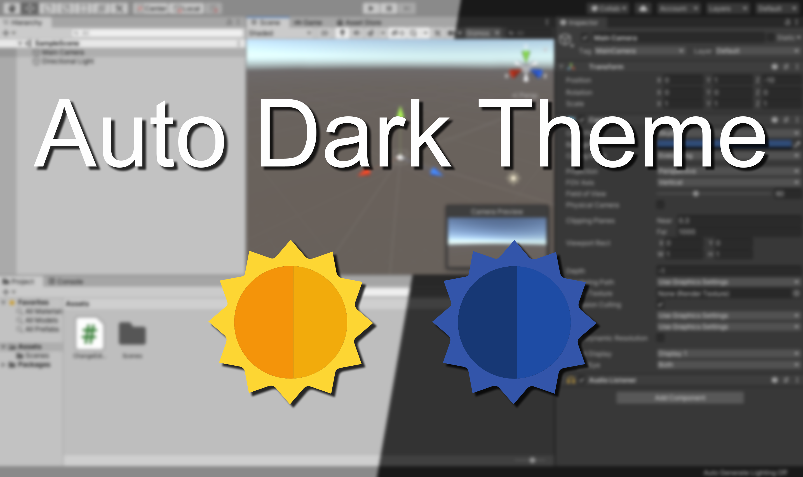

# Auto Dark Theme for Unity

Automatically sets the Unity editor theme based on current time or system theme. 

Supported operating system for system-based theme switching:

* Windows 10 Version 1903
* macOS Mojave (10.14.0)

## Installation

### Asset Store

Install from https://assetstore.unity.com/packages/slug/180747.

### Package Manager

#### Local

Clone this project locally and go to `Window > Package Manager > + > Add package from disk...` and add `package.json`.

#### Git

Add `https://github.com/biosmanager/AutoDarkTheme.git#release` to `Window > Package Manager > + > Add package from git URL...`.

This will use the latest released version. You can also append `#master` instead of `#release` to the URL for the master branch or use `#<tag-or-commit>` for a specific tag or commit. See [UPM Git dependencies](https://docs.unity3d.com/Manual/upm-git.html).

## Configuration

Go to `Preferences > Auto Dark Theme`.

* **Enabled** - Determines whether the editor theme is automatically changed.
* **Change theme based on** 
  * `System` - Follow system theme.
  * `Time` - Enable light and dark theme at specific times.
* **Enable light theme at** - The time of day at which the light theme is activated. `hh:mm:ss` (24-hour format).
* **Enable dark theme at** - The time of day at which the dark theme is activated. `hh:mm:ss` (24-hour format).

## Automatic Windows 10 theme switching
Windows 10 does not support time-based switching between its light and dark mode but there is a tool for that:

https://github.com/Armin2208/Windows-Auto-Night-Mode

## Native components

On macOS, to query the current appeareance, a native plugin is used. You can find the source code [here](https://github.com/biosmanager/AutoDarkTheme-Native).
